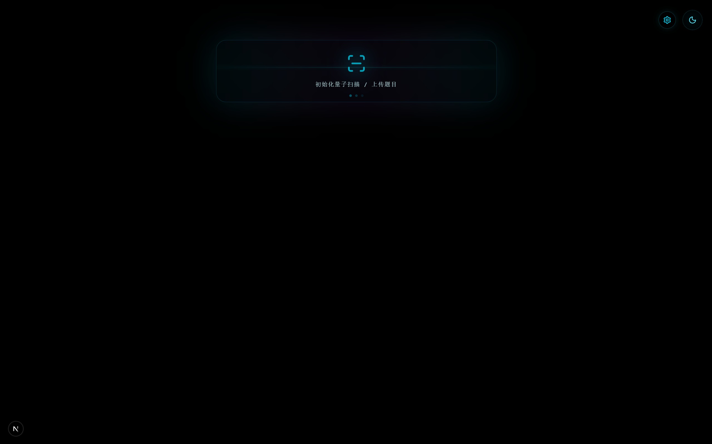
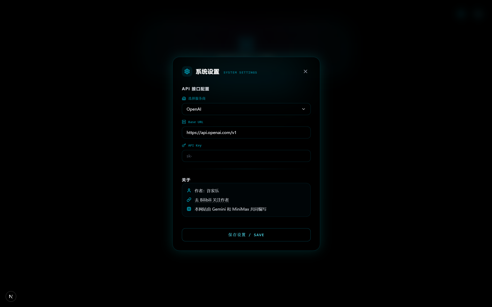
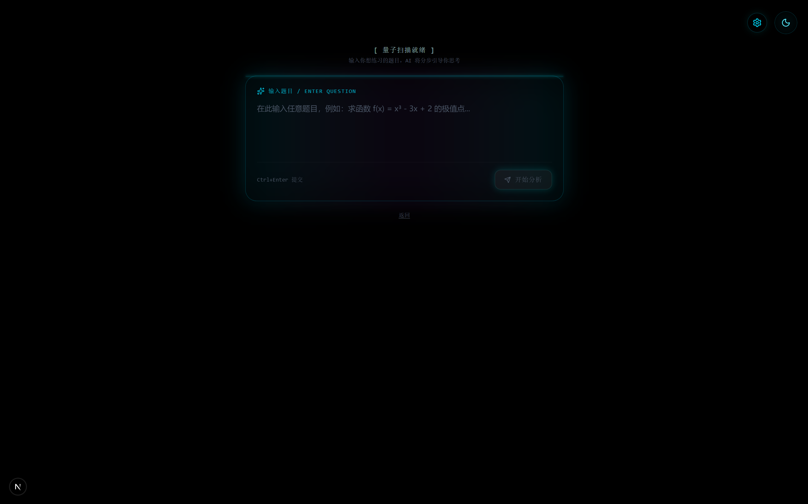
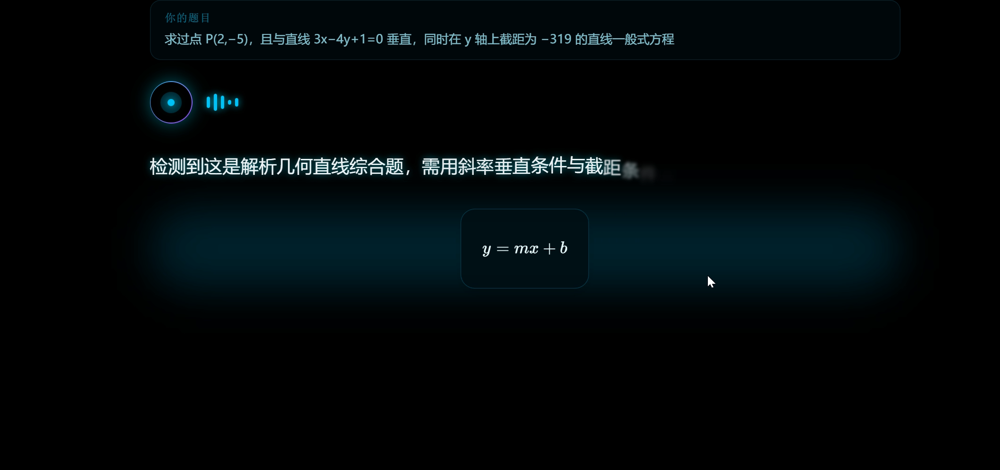

# AI 数学老师

一个基于 AI 的智能数学/理科教学助手，采用苏格拉底式问答法引导学生逐步理解题目，而非直接给出答案。通过启发式提问和分步引导，帮助学生真正掌握解题思路。

[在线体验](http://math.lunarmc.cn/) | [Bilibili 教程](https://www.bilibili.com/video/BV1a8oSBNEUN/)

***

## 项目简介

传统的 AI 解题工具往往直接给出答案，学生容易产生依赖。本项目采用苏格拉底式教学法，AI 不直接告诉学生答案，而是通过一系列启发式提问，引导学生主动思考，一步步接近正确答案。这种教学方式已被证明能够显著提升学生的理解能力和解题技巧。

### 核心特点

- **启发式教学**：通过提问引导思考，而非直接给答案
- **自适应难度**：根据题目复杂度自动调整教学轮数
- **即时反馈**：对每个选择提供详细的正误解释
- **数学公式支持**：完整的 LaTeX 公式渲染
- **多 API 支持**：兼容各种主流 AI 服务商

***

## 功能特性

### 苏格拉底式教学

传统教学往往直接给出答案，学生容易产生依赖。本项目通过以下方式实现真正的启发式教学：

- AI 导师根据题目难度制定 1-5 轮教学计划
- 每轮包含：知识讲解 -> 引导提问 -> 选择作答 -> 正误反馈
- 引导学生主动思考，而非被动接受答案
- 最终帮助学生形成完整的解题思维

### 数学支持

强大的数学公式渲染能力：

- 完整的 LaTeX 支持
- 支持分数、积分、矩阵、根号等复杂表达式
- 可视化解题步骤和公式推导
- 与文本混合排版

### 多 API 支持

支持多种 AI 服务商，可根据需求灵活选择：

| 服务商 | 说明 |
|--------|------|
| OpenAI | GPT 系列模型 |
| Anthropic | Claude 系列模型 |
| Google | Gemini 系列模型 |
| DeepSeek | DeepSeek 系列模型 |
| X.AI | Grok 系列模型 |
| SiliconFlow | 聚合 API 服务 |
| MiniMax | MiniMax 系列模型 |
| 自定义 | 支持任意兼容 OpenAI 格式的 API |

### 精美界面

现代化 UI 设计，提供优质用户体验：

- 科幻风格视觉设计
- 暗色/亮色主题切换
- 流畅的动画效果
- 响应式布局，适配各种设备

***

## 界面预览



主界面采用简洁的扫描式入口设计，营造科技感。



输入你想练习的数学或理科题目。



支持多种 AI 服务商配置，满足不同需求。



分步引导学习，每轮包含引导、提问、选择和反馈。

***

## 快速开始

### 环境要求

- Node.js 18 或更高版本
- npm 或 yarn 包管理器

### 安装

```bash
# 克隆项目
git clone https://github.com/jialehh/math-tutor.git
cd math-tutor

# 安装依赖
npm install

# 启动开发服务器
npm run dev
```

访问 [http://localhost:3000](http://localhost:3000) 查看应用。

### 配置 API

1. 点击右上角的设置图标
2. 从下拉菜单选择 AI 服务商
3. 如果选择"自定义"，需要填写：
   - Base URL：API 端点地址
   - API Key：你的 API 密钥
   - 模型名称：使用的模型名称
4. 点击保存

### 构建生产版本

```bash
# 构建
npm run build

# 启动生产服务器
npm start
```

***

## 项目结构

```
math-tutor/
├── app/                          # Next.js App Router
│   ├── api/                      # API 路由
│   │   └── chat/                 # AI 对话接口
│   │       └── route.ts           # API 路由处理
│   ├── page.tsx                  # 主页面
│   └── layout.tsx                # 布局组件
│
├── components/                   # React 组件
│   ├── ChoiceTerminal.tsx        # 选择题终端组件
│   ├── KineticText.tsx           # 动态文字打字效果
│   ├── MathBlock.tsx             # 数学公式渲染块
│   ├── MixedText.tsx             # 混合文本组件
│   ├── QuestionInput.tsx         # 问题输入框组件
│   ├── Scanner.tsx                # 扫描动画效果
│   ├── SettingsModal.tsx          # 设置弹窗
│   ├── ThemeProvider.tsx          # 主题上下文提供者
│   ├── ThemeToggle.tsx            # 主题切换按钮
│   └── Waveform.tsx              # 波形动画组件
│
├── hooks/                        # React Hooks
│   └── use-mobile.ts             # 移动端检测
│
├── lib/                          # 工具函数
│   └── utils.ts                  # 通用工具
│
├── assets/                       # 静态资源
│   └── screenshot-*.png          # 截图
│
├── public/                       # 公共静态资源
│
└── 配置相关
    ├── package.json              # 项目配置
    ├── tsconfig.json             # TypeScript 配置
    ├── tailwind.config.ts        # Tailwind CSS 配置
    └── next.config.ts           # Next.js 配置
```

### 核心文件说明

| 文件 | 说明 |
|------|------|
| `app/api/chat/route.ts` | AI 对话 API 路由，处理所有 AI 请求 |
| `app/page.tsx` | 主页面，包含完整的学习流程逻辑 |
| `components/SettingsModal.tsx` | 设置弹窗，管理 API 配置 |

***

## 使用流程

### 完整教学流程

1. **输入题目**
   - 在主界面输入数学或理科题目
   - 支持各种复杂的数学表达式

2. **AI 分析**
   - 系统自动分析题目难度
   - 制定相应的教学计划（1-5 轮）

3. **分步学习**
   - AI 导师进行知识讲解
   - 提出引导性问题
   - 学生选择答案

4. **即时反馈**
   - 选中后立即显示正误反馈
   - 详细解释选择原因
   - 纠正错误思路

5. **总结回顾**
   - 教学完成后给出整体总结
   - 回顾所有解题步骤
   - 形成完整知识体系

### 题目难度与教学轮数

| 难度等级 | 教学轮数 | 每轮引导语长度 |
|----------|----------|----------------|
| 简单 (1-2) | 1-2 轮 | 约 30 字 |
| 中等 (3) | 2-3 轮 | 约 40-60 字 |
| 复杂 (4-5) | 3-5 轮 | 约 60-100 字 |

***

## 技术栈

### 核心框架

- **Next.js 15** - React 全栈框架，使用 App Router
- **React 19** - UI 库
- **TypeScript** - 类型安全

### 样式与动画

- **Tailwind CSS 4** - 原子化 CSS 框架
- **Motion** - 流畅的动画效果（基于 Framer Motion）
- **Lucide React** - 图标库

### 数学渲染

- **KaTeX** - 高性能数学公式渲染
- **react-katex** - React 组件封装

### AI 集成

- **OpenAI SDK** - 兼容各种 OpenAI 格式的 API

***

## 部署

### Vercel（推荐）

1. 将项目推送到 GitHub
2. 在 [Vercel](https://vercel.com) 导入项目
3. 无需特殊配置，自动部署

### Docker

```bash
# 构建镜像
docker build -t math-tutor .

# 运行容器
docker run -p 3000:3000 math-tutor
```

### 其他平台

项目可部署到任何支持 Node.js 的平台：

- Railway
- Render
- Fly.io
- 各类云服务器

***

## License

MIT License

你可以自由使用、修改和分发本项目。

***

## 作者

**许家乐**

- Bilibili: [https://space.bilibili.com/694979371](https://space.bilibili.com/694979371)

***

## 致谢

本项目的诞生离不开以下开源项目：

- [Next.js](https://nextjs.org/)
- [Tailwind CSS](https://tailwindcss.com/)
- [Motion](https://motion.dev/)
- [KaTeX](https://katex.org/)
- [OpenAI](https://openai.com/)

***

如果你觉得这个项目有帮助，请给个 Star！
